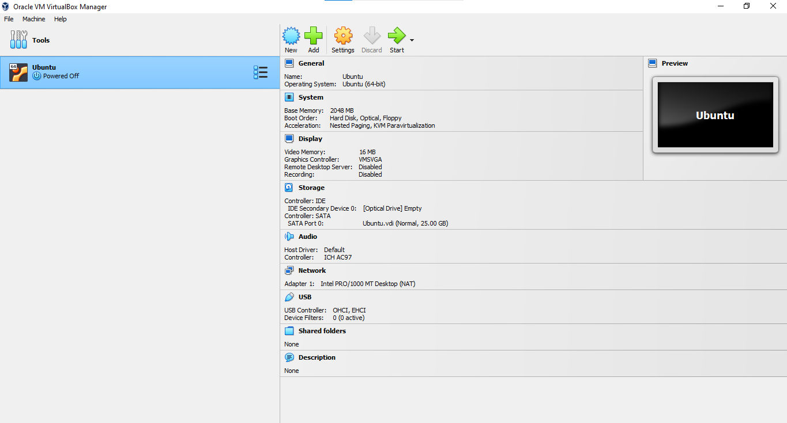
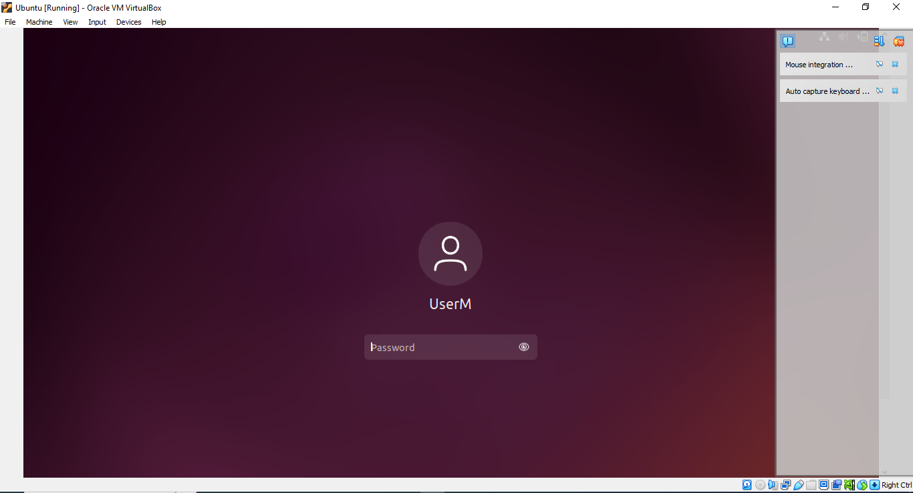
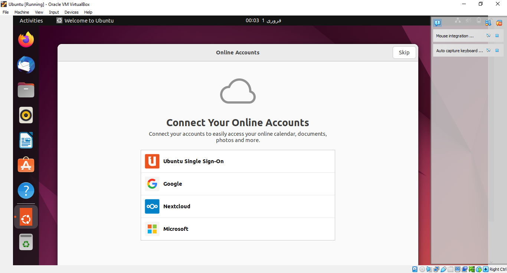
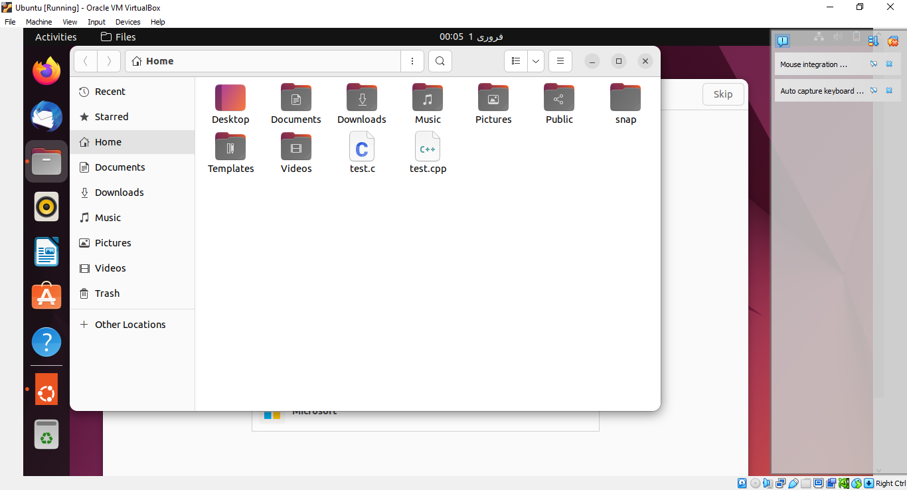
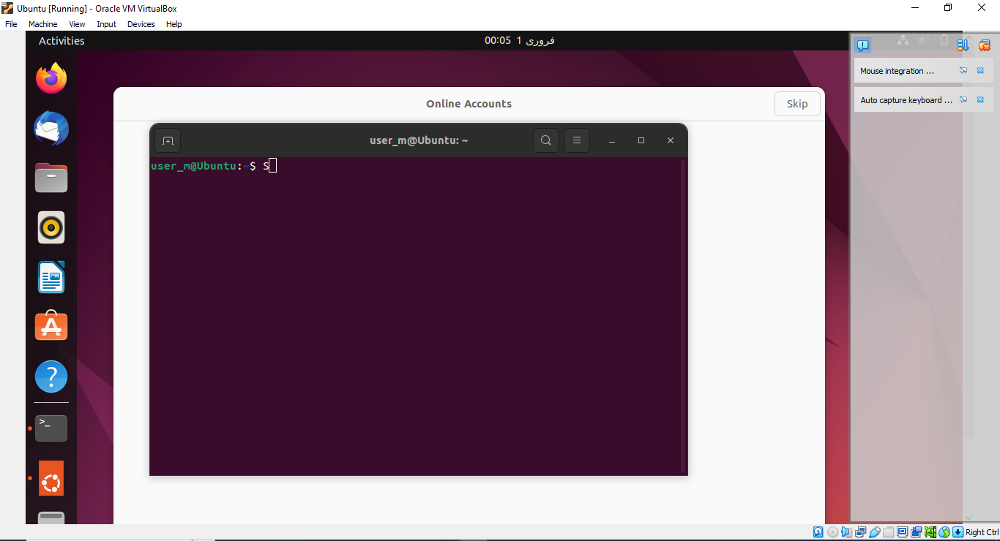
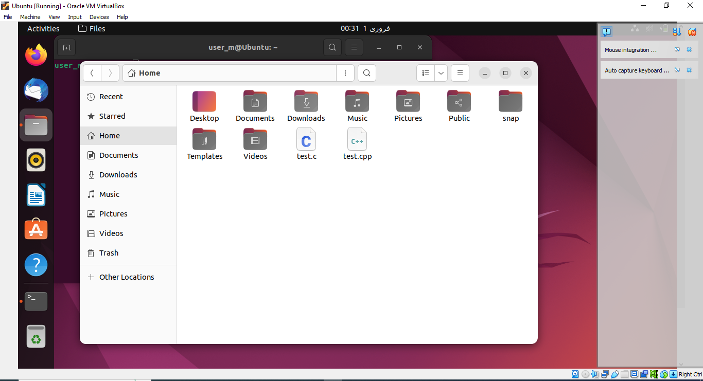
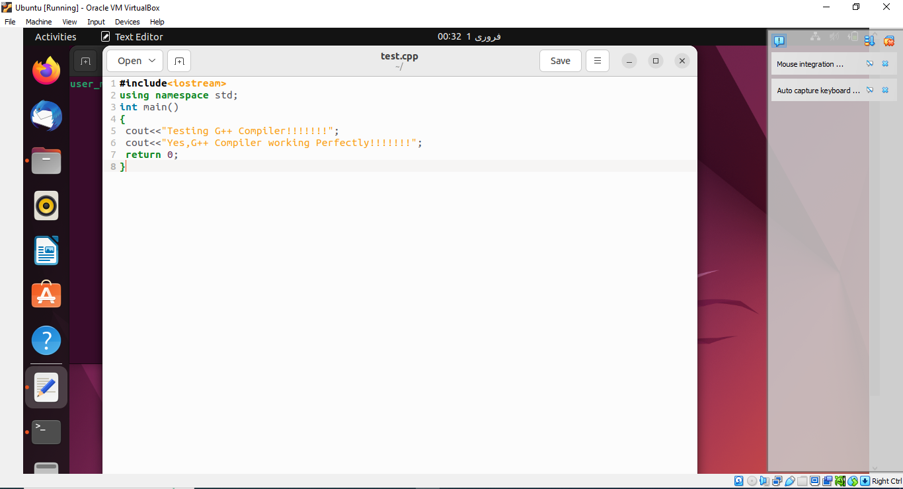
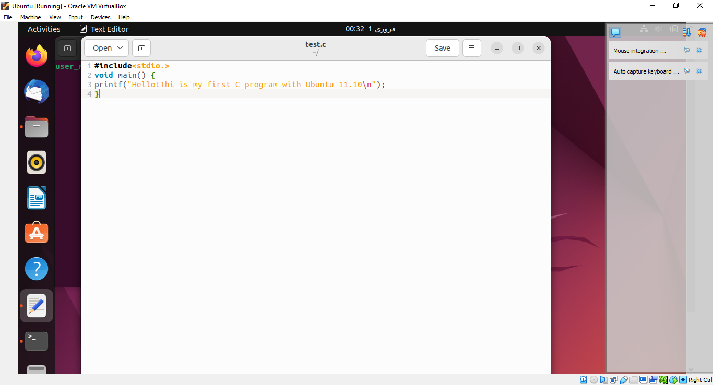
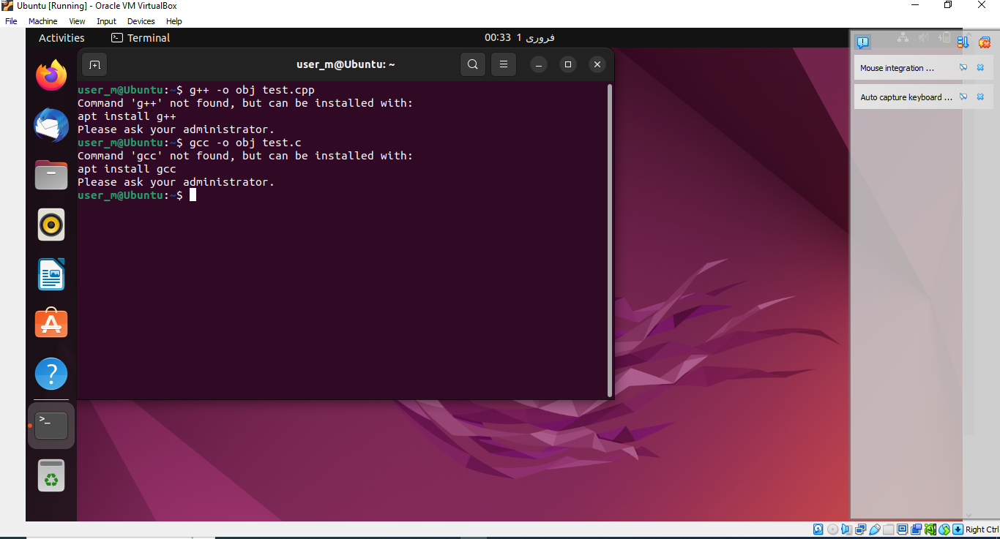

<b style="font-size:24px;">Operating System</b>

 Session: 2022 – 2026  
									

<b style="font-size:20px;">Submitted by: </b>
  Malahat Batool    2022-CS-44  

​								        

<b style="font-size:20px;"> Supervised by:  </b>
     Sir Nauman Shafi 
    Sir Aqib  Chatthab  
								    	    

<b style="font-size:19px;"> University of Engineering and Technology, 
 Lahore Pakistan 	

 							 “Department of Computer Science”

​				

​	

##                                                  LAB 2

###                                                          TASK 1

##### Step 1: VMware Workstation

1. Download and install VMware Workstation.
2. Open VMware Workstation.

##### Step 2: Create a New Virtual Machine

1. Click "File" > "New Virtual Machine."
2. Choose "Typical" and click "Next."
3. Select "Installer disc image file (iso)" and browse to your Ubuntu ISO.
4. Enter a name and location for your virtual machine. Click "Next."
5. Set disk capacity and click "Finish."

##### Step 3: Install Ubuntu

1. Power on the virtual machine.
2. Select language, click "Install Ubuntu," and follow on-screen instructions.
3. Choose location, keyboard layout, and create a user account.
4. Decide on third-party software installation.
5. After installation, click "Restart Now."

##### Step 4: Post-Installation

1. Remove installation media and press "Enter."
2. Log in with the user account created during installation.

##### Conclusion

   You've successfully installed Ubuntu on VMware

#### Screenshots:

###                                                       

###                                                          TASK 2 

- Begin by creating a file using the terminal. Use the `touch` command followed by the desired file name.

- Navigate to the "files" folder where the file was created.

- Open the newly created file.

- Inside the file, write programs to check the installation status of the `g++` and `gcc` compilers.

- Save and close the file.

- Compile and execute the programs to check the compiler installations.

  #### Screenshots:

  

  

  

  

  

  ###                                                      TASK 3

  ##### GitHub Repository Link

  https://github.com/malahat456/OS-Lab

  

  